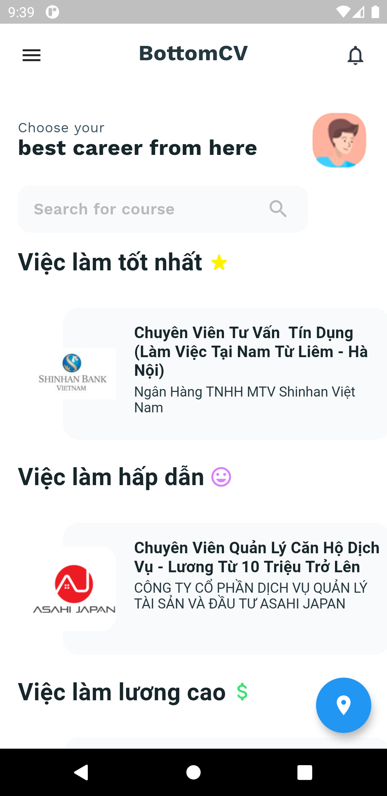
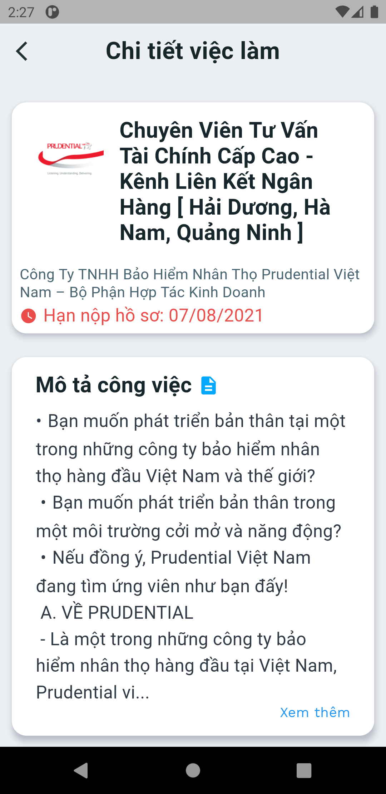
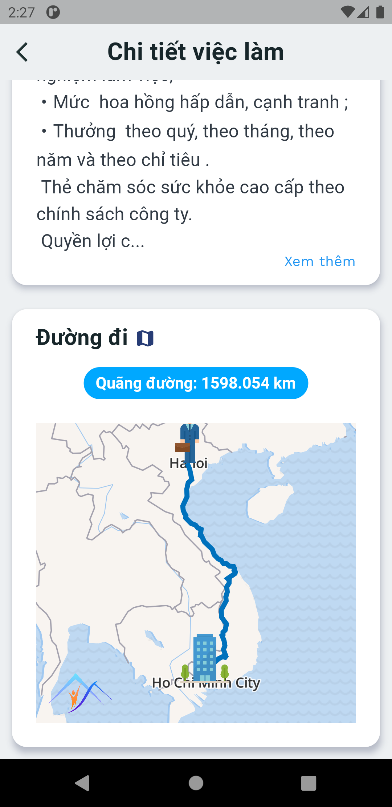
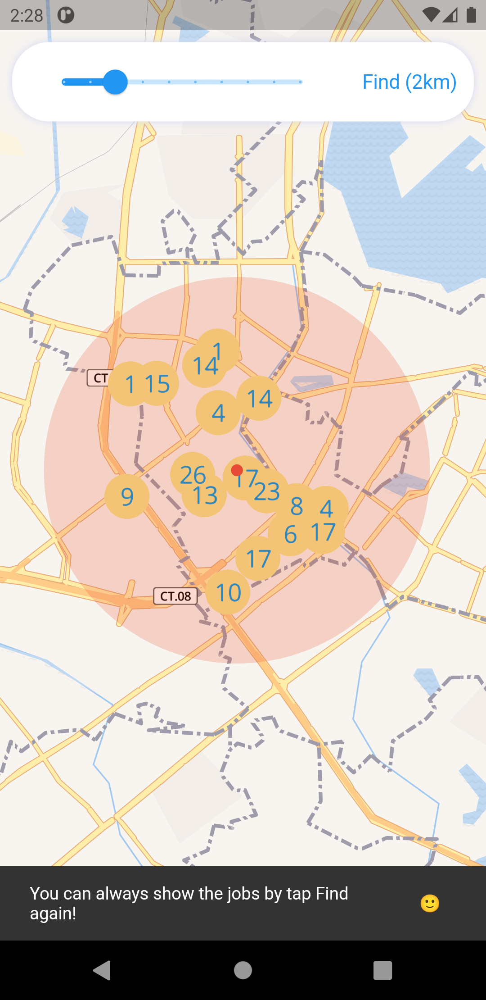
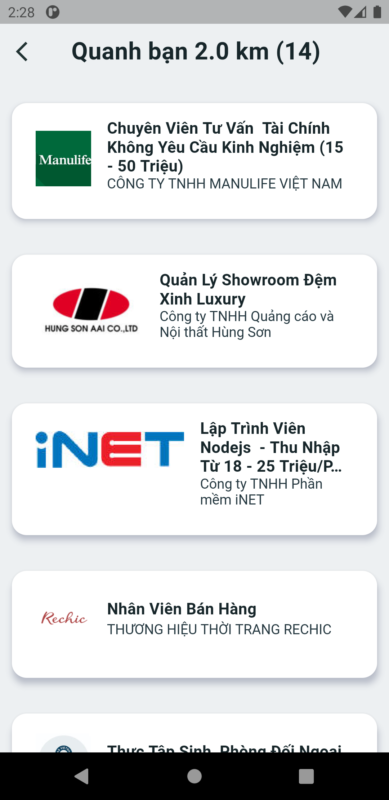
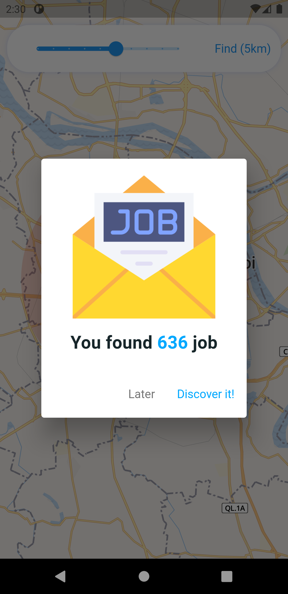

# BottomCV :office:

A Flutter application for finding a job for your fukin trash career (joke)


## Installation

This application requires

```bash
Wemap SDK, flutter
```

Run `Pub get`

**Notice**: The main android project is under `./data_warehouse_app`, so open this folder on Android studio. 

If you want to open the whole project (wemapgl + data_warehouse_app), remember to change your Dart entry point (`Run -> Dart entrypoint`) to `.\data_warehouse_app\data_warehouse_app\lib\main.dart` (not `data_warehouse_app\lib\main.dart`)

## Features

* Show list job by category in home screen
* Job detail screen have a map show route from current location to the job.
* Find job around you by pre-set distance (job near by each other can be unioned).


## Screenshots

<!--  -->
[](image.png)
[](job_details.png)
[](job_details_map.png)

[](find_job.png)
[](list_job.png)
[](success_find.png)


## Authors

- [@HKAB](https://www.github.com/HKAB)
- [@tacbliw](https://github.com/tacbliw)
- [@xuantruong2000](https://github.com/xuantruong2000)
- [@ultoxtung](https://github.com/ultoxtung)
- [@thaopanda](https://github.com/thaopanda)

# Data & References

Data is crawled from [Topcv](https://www.topcv.vn/viec-lam)

UI is cloned and modifed from [Best-Flutter-UI-Templates](https://github.com/mitesh77/Best-Flutter-UI-Templates)
